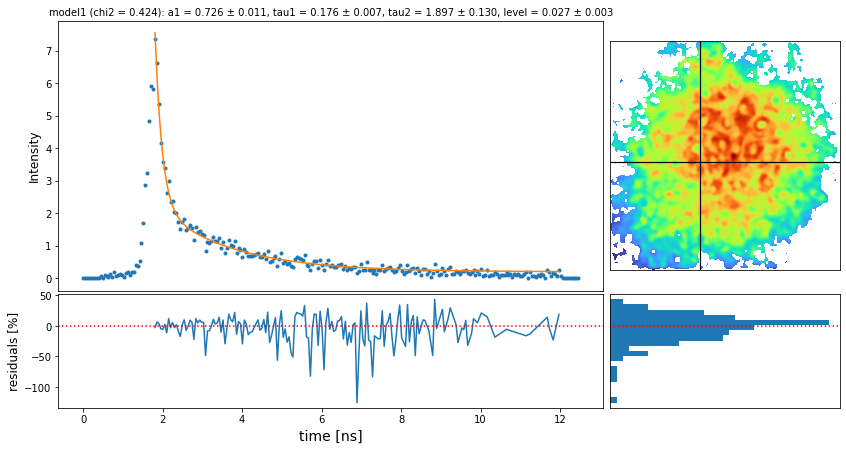

## flimview

### Conda Installation

First create a python 3 conda environment

    conda create -n flimview python=3 -y

To activate such environment

    conda activate flimview

To install the need requirements

    conda install -y -c conda-forge jupyterlab ipywidgets nodejs

To enable the widgets

    jupyter labextension install @jupyter-widgets/jupyterlab-manager

and finally to install flimview from github

    pip install git+https://github.com/mgckind/flimview.git --upgrade

#### Optional Packages

To run few things in parallel and other analysis you can install a few more packages

    pip install scikit-image dask[complete] dask-jobqueue --upgrade

### Examples

Check the notebooks examples [here](notebooks/)

### Development

To contribute to this package, first clone it:

    git clone https://github.com/mgckind/flimview.git

Then inside flimview

    pip install -e .

